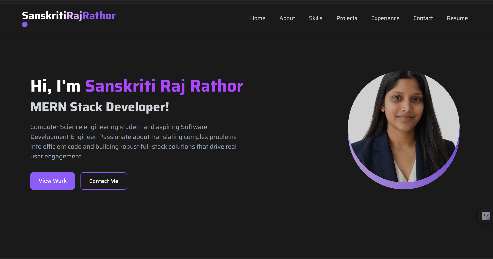

# 🌐 Personal Portfolio

  
  
  
  

---

## 🚀 Live Demo

🔗 https://personal-portfolio-lrgc17a5d-sanskritirajrathor.vercel.app/

---

## 🧑‍💻 About The Project

This is my **personal portfolio website** built to showcase my:
- 💼 Projects  
- 🛠 Skills  
- 📈 Experience  
- 📬 Contact information  

It is designed with a **modern UI**, smooth performance, and full responsiveness across devices.

---

## ✨ Features

- 🎨 Modern and clean UI
- 📱 Fully responsive design
- ⚡ Lightning-fast performance (Vite)
- 🧩 Component-based architecture
- 💻 Project showcase section
- 📬 Contact form / section
- 🌙 Developer-friendly code structure

---

## 🛠️ Tech Stack

| Category       | Technology |
|---------------|-----------|
| Frontend      | HTML, CSS, JavaScript |
| Framework     | Vite |
| Styling       | Tailwind CSS |
| Deployment    | Vercel |

---

Example:

